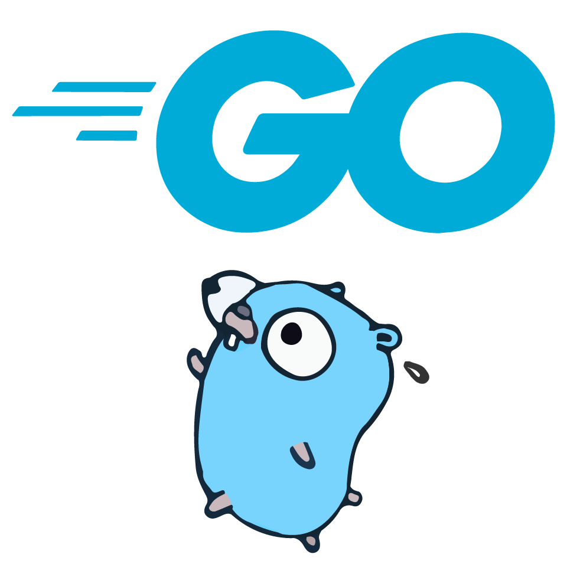

# **GO EXPERT** | [FULL CYCLE](https://goexpert.fullcycle.com.br) | 2026 

---
## Desafio técnico | cliente-servidor para cotação de dólar (USD/BRL)

---

### Objetivo

> Criar um sistema simples em Go lang composto por um cliente e um servdor que se comunicam via HTTP, visando obter cotação de dólar (USD/BRL).

### Componentes principais

- **server.go**  
  Servidor HTTP na porta 8080 com endpoint `/cotacao` que:
    - Consome a cotação USD-BRL da API externa  
      - https://economia.awesomeapi.com.br/json/last/USD-BRL  
      - **Timeout máximo: 200ms**
    - Persiste a cotação em banco SQLite  
      - **Timeout máximo: 10ms**
    - Retorna o JSON da cotação para o cliente
    - Registra erros de timeout no console

- **client.go**  
  Cliente que:
    - Faz requisição ao servidor local (`http://localhost:8080/cotacao`)  
      → **Timeout máximo: 300ms**
    - Extrai apenas o valor **bid** (preço de compra)
    - Grava no arquivo `cotacao.txt` no formato:

> Todos os requisitos estão definidos em [Requisitos do desafio](./docs/requisitos.md)
